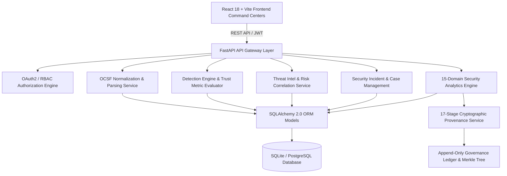
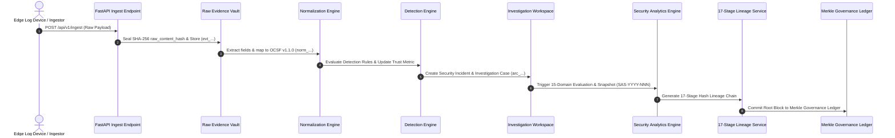

# SentinelTrace V5

**Verifiable Security Log Normalization, Deterministic Intelligence & Cryptographic Lineage Governance Platform**

> **Smart India Hackathon 2026** — Cybersecurity Track  
> **Repository**: [github.com/abhilash-210/SentinelTrace-V5](https://github.com/abhilash-210/SentinelTrace-V5.git)  
> **Status**: COMPLETE, VERIFIED & FROZEN (Sprint 13 Security Hardened)  
> **Test Coverage**: **935 / 935 Full Regression Tests Passing** (0 Failures, 0 Errors) | **68 / 68 Sprint 13 Hardening Tests Verified**  

---

## 1. Project Overview

**SentinelTrace V5** is an enterprise-grade, zero-trust security intelligence platform engineered to eliminate log format chaos and provide mathematical proof of evidence provenance in modern Security Operations Centers (SOCs). 

By pairing multi-vendor log ingestion with **Open Cybersecurity Schema Framework (OCSF v1.1.0)** normalization and a **17-Stage SHA-256 Cryptographic Lineage Chain**, SentinelTrace ensures that security telemetry can be parsed, correlated, investigated, and audited without reliance on vendor-proprietary text formats or unverifiable log servers.

### Core Scope Expansion
While originally conceived to address raw log parsing and schema mapping, SentinelTrace V5 expands the core normalization pipeline into a complete, end-to-end SOC operations platform incorporating threat intelligence, risk correlation, forensic case management, compliance baselining, zero-trust security analytics, multi-template executive reporting, and Maker-Checker dual governance.

---

## 2. Problem Statement

### The Heterogeneous Log Challenge
Modern Security Operations Centers ingest millions of logs daily across firewalls, endpoints, identity providers, cloud services, and network switches. These logs create critical operational bottlenecks:

1. **Schema & Field Inconsistency**: The source IP address may appear as `src_ip`, `source_ip`, `src_address`, or `client_ip` depending on the vendor format.
2. **Format Fragmentation**: JSON, Syslog (Key-Value), CSV, CEF, XML, and Windows Event Logs require separate parsing rules and maintenance overhead.
3. **Lack of Evidence Integrity**: Standard Syslog transmission uses unencrypted, unauthenticated protocols without cryptographic digests. Adversaries who access log repositories can alter timestamps or delete intrusion evidence without detection.
4. **False Clean Posture in SIEMs**: Traditional SIEM platforms treat missing or dropped log streams as "0 alerts", generating false clean reports during telemetry outages.

---

## 3. Proposed Solution

SentinelTrace V5 addresses these challenges through a unified, verifiable security intelligence pipeline:

```
[Raw Security Evidence] ──> (SHA-256 Evidence Seal)
          │
          ▼
[Multi-Format Ingestion Vault] ──> [OCSF v1.1.0 Normalization Engine]
          │
          ▼
[Semantic Interpretation & Policy Registry] ──> [Detection & Trust Engine]
          │
          ▼
[Threat Intelligence Correlation] ──> [Risk Scoring & Incident Creation]
          │
          ▼
[Forensic Case Investigation] ──> [Assurance & Remediation Recovery]
          │
          ▼
[15-Domain Security Analytics] ──> [17-Stage Cryptographic Lineage Chain]
          │
          ▼
[Executive Security Report] ──> [Reference-Only Evidence Package]
          │
          ▼
[Governance Ledger & Merkle Proof Verification]
```

---

## 4. Key Capabilities

- **Format-Agnostic Normalization**: Parses Syslog, JSON, CSV, and CEF payloads into standardized OCSF v1.1.0 event classes (`Network Activity`, `IAM`, `System Activity`, `Security Finding`).
- **17-Stage Cryptographic Lineage Chain**: Calculates a SHA-256 hash digest at every stage of data processing and links it to the `previous_hash` of the preceding stage.
- **Zero-Trust Telemetry Rules**: Mathematical score capping logic ensures missing, stale, or unverified telemetry degrades overall security confidence rather than fabricating high scores.
- **Maker-Checker Dual Governance**: Privileged administrative actions (rule version approvals, incident containment authorizations) require dual-operator approval ($\text{Proposer User ID} \neq \text{Approver User ID}$).
- **Threat Intelligence Correlation**: Ingests IOC feeds (IPs, hashes, domains) and correlates entity behavior without automatically promoting raw matches to confirmed incidents.
- **15-Domain Security Analytics**: Evaluates platform security health across 15 distinct domains into point-in-time snapshots (`SAS-YYYY-NNN`).
- **Reference-Only Evidence Packaging**: Synthesizes executive evidence packages (`SEP-YYYY-NNN`) that bind artifact SHA-256 hashes without duplicating heavy raw payloads.
- **Multi-Layer Tamper Verification**: Recalculates canonical JSON hashes (`compute_canonical_hash`) to detect 1-bit payload modifications across reports and lineage chains.

---

## 5. Architecture

### High-Level System Architecture



---

## 6. End-to-End Workflow



---

## 7. Technology Stack

| Layer | Technology | Purpose |
|---|---|---|
| **Frontend Framework** | React 18, Vite 5 | Reactive UI rendering and SPA bundle optimization |
| **UI Components & Styling** | Lucide React, Vanilla CSS | Glassmorphism custom design system tokens |
| **Routing & Navigation** | React Router DOM v6 | Single Page Application route management |
| **Backend API Framework** | FastAPI 0.109+ (Python 3.11/3.12) | High-performance asynchronous REST API gateway |
| **Database ORM** | SQLAlchemy 2.0 | Schema-isolated object-relational database mapping |
| **Database Engine** | SQLite 3 (`sentinel_trace.db`) | Local persistent relational datastore (`sentinel` schema) |
| **Validation & Serialization**| Pydantic v2 | Strict request body validation and response serialization |
| **Authentication & RBAC** | OAuth2 Password Bearer, PyJWT | JSON Web Tokens, password hashing, 32 permissions |
| **Cryptography** | Standard Python `hashlib` (SHA-256) | Canonical JSON hashing, hash chaining, Merkle trees |
| **Automated Testing** | Python `unittest` framework | 935 platform regression tests & 68 hardening tests |

---

## 8. Security & Governance

- **Authentication**: JWT access tokens signed via HMAC-SHA256 (`HS256`).
- **Role-Based Access Control (RBAC)**: Enforces 5 distinct system roles (`ADMIN`, `SECURITY_ANALYST`, `SECURITY_REVIEWER`, `COMPLIANCE_AUDITOR`, `VIEWER`) across 32 granular permissions.
- **Maker-Checker Dual Governance**: Proposer ID cannot equal Approver ID for privileged rule modifications, containment authorizations, or remediation plans.
- **Canonical Hash Determinism**: Keys are sorted alphabetically and whitespace stripped before hashing (`compute_canonical_hash`), ensuring cross-platform hash consistency.
- **Fail-Safe Closed Behavior**: Unauthenticated write attempts return HTTP 401; unauthorized role access returns HTTP 403; bad payload structures return HTTP 400/422.

*Note: Automated security tests verify implemented controls and invariants; they do not imply absolute zero-vulnerability guarantees.*

---

## 9. Testing & Verification Results

The SentinelTrace V5 test suite provides comprehensive verification across unit logic, API routers, database models, cryptographic tamper detection, and RBAC boundary enforcement.

### 1. Sprint 13 Security Hardening Suite (`tests/test_sprint13_final_hardening.py`)
- **Total Tests**: 68
- **Passed**: 66 OK
- **Skipped**: 2 (legitimate endpoint guards for optional containment routes)
- **Failures / Errors**: 0

### 2. Full Platform Regression Suite
- **Execution Command**: `python -m unittest discover -s tests -p "test_*.py"`
- **Total Tests**: **935**
- **Passed**: **933 OK**
- **Skipped**: 2
- **Failures / Errors**: **0**
- **Suite Execution Time**: 74.64s

*Note: The automated test suite proves the implementation of functional contracts and security invariants, but does not substitute for third-party penetration testing.*

---

## 10. Project Structure

```
SENTINEL-TRACE/
├── .env.example                      # Environment variables template
├── .gitignore                         # Version control ignore rules
├── README.md                          # Master GitHub documentation
├── docker-compose.yml                 # Multi-container orchestration config
├── backend/                           # FastAPI Backend Application
│   ├── app/
│   │   ├── core/                      # Auth, RBAC permissions, configuration
│   │   ├── models/                    # 27 SQLAlchemy ORM data models
│   │   ├── parsers/                   # Multi-format log parsing utilities
│   │   ├── routers/                   # 29 FastAPI REST API router modules
│   │   ├── schemas/                   # Pydantic validation schemas
│   │   └── services/                  # 25 domain logic services
│   ├── tests/                         # Test suites (935 regression tests)
│   └── sentinel_trace.db              # SQLite development database
├── frontend/                          # React + Vite Frontend Application
│   ├── src/
│   │   ├── components/                # Shared UI cards, headers, sidebars
│   │   └── pages/                     # 26 React Command Center pages
│   ├── package.json                   # Frontend node dependencies
│   └── vite.config.js                 # Vite bundler configuration
├── prototype project report/          # Complete 24-Document Technical Report Package
│   ├── FINAL_PROJECT_REPORT.md        # Master 32-section project report
│   ├── ARCHITECTURE.md                # Technical architecture reference
│   ├── DATABASE_ARCHITECTURE.md       # ORM model database reference
│   ├── SIH_DEMO_GUIDE.md              # 5–10 minute judge demonstration script
│   └── SETUP_AND_RUN_GUIDE.md         # Full installation & setup guide
├── sample-data/                       # Synthetic sample log payloads
└── scratch/                           # Seeding scripts (seed_sih_demo.py)
```

---

## 11. Installation

### Prerequisites
- **Python 3.11 or 3.12**
- **Node.js 18+** and `npm`
- **Git**

### Step-by-Step Setup

1. **Clone the repository**:
   ```powershell
   git clone https://github.com/abhilash-210/SentinelTrace-V5.git
   cd SentinelTrace-V5
   ```

2. **Set up the Backend**:
   ```powershell
   cd backend
   python -m venv .venv
   .\.venv\Scripts\Activate.ps1
   pip install -r requirements.txt
   ```

3. **Set up the Frontend**:
   ```powershell
   cd ../frontend
   npm install
   ```

4. **Initialize Demo Data**:
   ```powershell
   cd ..
   & "backend/.venv/Scripts/python.exe" -m scratch.seed_sih_demo
   ```

---

## 12. Running the Application

### 1. Start Backend API Server
```powershell
cd backend
uvicorn app.main:app --reload --port 8000
```
- **API Base URL**: `http://localhost:8000`
- **Swagger Documentation**: `http://localhost:8000/docs`
- **Health Check Endpoint**: `http://localhost:8000/api/v1/health`

### 2. Start Frontend UI Development Server
```powershell
cd frontend
npm run dev
```
- **UI Command Center**: `http://localhost:5173`

---

## 13. Demonstration

To conduct a live demonstration of SentinelTrace V5, use the pre-configured demo credentials:

| Role | Username | Password | Key Demo Features |
|---|---|---|---|
| Admin | `admin_demo` | `password` | System overview, user management, rule proposals |
| Security Analyst | `analyst_demo` | `password` | Log triage, incident investigation, case timeline |
| Security Reviewer | `reviewer_demo` | `password` | Dual approval, containment authorization |
| Compliance Auditor | `auditor_demo` | `password` | Governance ledger inspection, report verification |
| Executive Viewer | `viewer_demo` | `password` | Executive posture dashboard, read-only analytics |

For the complete 5–10 minute step-by-step judge presentation script and visual guide, refer directly to:
👉 [`prototype project report/SIH_DEMO_GUIDE.md`](prototype%20project%20report/SIH_DEMO_GUIDE.md)

---

## 14. Comprehensive Documentation Package

The complete project documentation package is located in the [`prototype project report/`](prototype%20project%20report/) directory and contains 24 technical reference documents:

- **Master Executive Summary**: [`FINAL_PROJECT_REPORT.md`](prototype%20project%20report/FINAL_PROJECT_REPORT.md)
- **Architecture Reference**: [`ARCHITECTURE.md`](prototype%20project%20report/ARCHITECTURE.md)
- **Backend Architecture**: [`BACKEND_ARCHITECTURE.md`](prototype%20project%20report/BACKEND_ARCHITECTURE.md)
- **Frontend Architecture**: [`FRONTEND_ARCHITECTURE.md`](prototype%20project%20report/FRONTEND_ARCHITECTURE.md)
- **Database Architecture**: [`DATABASE_ARCHITECTURE.md`](prototype%20project%20report/DATABASE_ARCHITECTURE.md)
- **Cryptographic Security**: [`CRYPTOGRAPHIC_SECURITY.md`](prototype%20project%20report/CRYPTOGRAPHIC_SECURITY.md)
- **Security Governance & RBAC**: [`SECURITY_GOVERNANCE.md`](prototype%20project%20report/SECURITY_GOVERNANCE.md)
- **SIH Judge Defense Q&A**: [`PROJECT_EXPLANATION_FOR_JUDGES.md`](prototype%20project%20report/PROJECT_EXPLANATION_FOR_JUDGES.md)
- **Limitations & Future Scope**: [`LIMITATIONS_AND_FUTURE_SCOPE.md`](prototype%20project%20report/LIMITATIONS_AND_FUTURE_SCOPE.md)

---

## 15. Current Limitations

1. **Development Relational Database**: Uses an embedded SQLite backend (`sentinel_trace.db`) for rapid dev setup. Production deployment requires migration to PostgreSQL / TimescaleDB.
2. **In-Process Pipeline Execution**: Log ingestion, parsing, and hash calculations execute within the FastAPI application process. Production scaling requires distributed streaming workers (Apache Kafka + Redis).
3. **In-Application Key Management**: Cryptographic signing keys are managed via environment variables. Production deployments should anchor keys to a Hardware Security Module (HSM) or AWS KMS.

---

## 16. Future Scope Roadmap

- **Distributed Streaming Workers**: Scale ingestion throughput to 100,000+ EPS using Rust-based edge agents and Apache Kafka.
- **Hardware Security Module (HSM) Root Anchoring**: Anchor Merkle tree root hashes to enterprise HSMs or public immutable ledgers (Ethereum / Polygon).
- **Automated SIEM Export Adapters**: Export OCSF-normalized events back into existing enterprise SIEMs (Splunk, Microsoft Sentinel).

---

## 17. License

This project is licensed under the **MIT License** — see the [LICENSE](LICENSE) file for details. Developed for Smart India Hackathon 2026.
