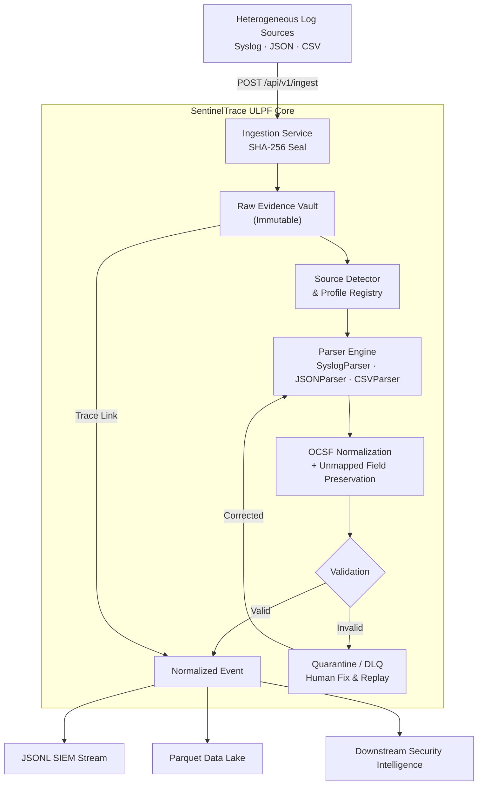

# SentinelTrace V5

## Universal Log Pre-processing Framework (ULPF)

**Smart India Hackathon 2026 — Problem Statement PS 26156**

Security Operations Centers today ingest logs from dozens of heterogeneous sources — firewalls, authentication gateways, servers, cloud services — each using proprietary formats. Traditional log pipelines discard raw payloads after transformation, silently drop malformed events, and make global semantic assumptions that break under vendor-specific context. SentinelTrace V5 is a prototype ULPF platform that addresses this by enforcing an immutable raw-evidence-first architecture: every log is cryptographically sealed before any parsing occurs, failures are quarantined rather than dropped, and every normalized output retains a mathematical tether back to its original evidence.

---

## Overview

SentinelTrace V5 accepts heterogeneous security logs (Syslog, JSON, CSV), preserves each raw event with a SHA-256 integrity fingerprint, parses and extracts source-specific fields, maps known fields to an OCSF-aligned canonical schema, retains unmapped proprietary fields in a structured JSON blob, validates the result, quarantines failures for human correction and replay, and exports normalized events to both a JSONL SIEM stream and partitioned Parquet files for downstream analytics.

The platform also includes a broader security intelligence suite (detection rules, semantic policies, risk correlation, incident management, compliance, and analytics) built on top of the normalization core, demonstrating how ULPF output feeds downstream SOC workflows.

---

## Key Capabilities

**Core ULPF Pipeline (Implemented)**
- Multi-format log ingestion (Syslog RFC 5424 / RFC 3164, JSON, CSV)
- Raw evidence preservation — payload stored unaltered before any parsing
- SHA-256 integrity fingerprint generated at ingestion
- Source-specific field extraction via declarative parser modules
- OCSF-aligned canonical normalization (`Network Activity`, `Authentication`, `System Activity`)
- Unmapped-field preservation in a `unmapped_data` JSON column
- Deterministic confidence scoring for normalization quality
- Source Profile Registry — plug-and-play source onboarding without code changes
- Validation engine with quarantine (Dead-Letter Queue) for failed events
- Human-in-the-loop correction and replay from preserved evidence
- Bidirectional traceability: normalized event → original raw evidence
- SIEM-style JSONL output stream
- Parquet Data Lake batch export (partitioned by date and source)
- Live SHA-256 integrity re-verification via API
- REST API with Swagger documentation
- Role-Based Access Control (RBAC) with 5 roles and 32 permissions
- Maker-Checker dual-approval governance
- Offline / air-gapped operation (zero external SaaS dependencies)
- Docker / Docker Compose containerized deployment

**Extended Security Intelligence (Built on ULPF output)**
- Semantic policy engine with vendor-scoped drift detection
- Detection rules with trust scoring
- Risk correlation and incident management
- Compliance intelligence and security analytics
- Executive reporting with cryptographic provenance chain

---

## Architecture



---

## How It Works

1. **Ingest** — A log payload arrives via `POST /api/v1/ingest`. The raw content is stored verbatim with a SHA-256 hash before any transformation begins.
2. **Detect** — The Source Detector reads the `source_type` and `file_format` to select the appropriate parser and source profile.
3. **Parse** — The selected parser (`SyslogParser`, `JSONParser`, or `CSVParser`) extracts structured fields from the raw string.
4. **Normalize** — Extracted fields are mapped to OCSF canonical columns (`src_ip`, `dst_ip`, `action`, `protocol`, `user_name`, etc.). Fields not in the OCSF schema are stored in `unmapped_data`.
5. **Validate** — A confidence score is calculated. Events below threshold are routed to the Quarantine queue with the failure reason.
6. **Quarantine & Replay** — A human analyst inspects the quarantined event, corrects the payload, and submits a replay. The replay executes against the *original* preserved evidence, not the corrected version (the correction is applied at re-parse time).
7. **Export** — Validated `NORMALIZED` events are appended to the JSONL forwarder log and batched into Parquet partition files.
8. **Trace** — Every normalized event carries an `original_event_id` foreign key. The Trace Link in the UI resolves this back to the raw evidence record with its SHA-256 hash for live re-verification.

---

## Technology Stack

| Layer | Technology |
|---|---|
| Frontend | React 18 + Vite 5 |
| Routing | React Router DOM v6 |
| Backend API | Python 3.11/3.12 + FastAPI 0.111 |
| ORM | SQLAlchemy 2.0 |
| Database | SQLite (local dev) / PostgreSQL 15 (Docker) |
| Migrations | Alembic |
| Validation | Pydantic v2 |
| Auth | JWT (python-jose) + bcrypt (passlib) |
| Cryptography | Python `hashlib` SHA-256 |
| Data Export | pandas + pyarrow (Parquet) |
| Container | Docker + Docker Compose |
| Testing | Python `unittest` |

---

## Project Structure

```
SentinelTrace-V5/
├── README.md                   # This file
├── .env.example                # Environment variable template
├── .gitignore
├── start_app.bat               # Windows one-click launcher
├── stop_app.bat                # Windows one-click shutdown
├── start_app.ps1               # PowerShell launcher
├── stop_app.ps1                # PowerShell shutdown
├── docker-compose.yml          # Multi-container orchestration
│
├── backend/
│   ├── app/
│   │   ├── core/               # Security: auth, RBAC, JWT
│   │   ├── models/             # SQLAlchemy ORM models (27 files)
│   │   ├── parsers/            # Log parsers: syslog, json, csv
│   │   ├── routers/            # FastAPI route handlers (33 modules)
│   │   ├── schemas/            # Pydantic request/response schemas
│   │   ├── services/           # Business logic layer
│   │   ├── config.py           # Settings (reads from .env)
│   │   ├── database.py         # Engine, session, SQLite fallback
│   │   └── main.py             # Application entry point
│   ├── migrations/             # Alembic schema migrations
│   ├── tests/                  # Test suites (35 test modules)
│   ├── outputs/                # Generated exports (gitignored at runtime)
│   └── requirements.txt
│
├── frontend/
│   ├── src/
│   │   ├── components/         # Shared UI components
│   │   ├── context/            # Auth context (JWT management)
│   │   └── pages/              # 26 UI page modules
│   ├── package.json
│   └── vite.config.js
│
├── docs/
│   ├── ARCHITECTURE.md
│   ├── DEMO_GUIDE.md
│   ├── FINAL_PROJECT_REPORT.md
│   ├── SIH_REQUIREMENT_MAPPING.md
│   ├── API_REFERENCE.md
│   ├── TESTING_AND_VERIFICATION.md
│   └── LIMITATIONS_AND_FUTURE_SCOPE.md
│
├── scripts/
│   ├── live_telemetry_simulator.py   # Pushes synthetic events via API
│   ├── seed_sih_demo.py              # Seeds demo data
│   └── verify_4_phases.py           # CLI end-to-end pipeline check
│
└── examples/
    └── sample_logs/                  # Sample Syslog, JSON, CSV payloads
```

---

## Installation

### Prerequisites
- **Python 3.11 or 3.12** (not 3.13+)
- **Node.js 18+** with npm
- **Git**

### Quick Setup (Windows)

```bat
git clone https://github.com/abhilash-210/SentinelTrace-V5.git
cd SentinelTrace-V5

REM Run the launcher — it sets up venv and npm automatically
start_app.bat
```

### Manual Setup

```powershell
# 1. Clone
git clone https://github.com/abhilash-210/SentinelTrace-V5.git
cd SentinelTrace-V5

# 2. Backend
cd backend
python -m venv .venv
.venv\Scripts\Activate.ps1
pip install -r requirements.txt
cd ..

# 3. Frontend
cd frontend
npm install
cd ..

# 4. Start backend (separate terminal)
cd backend
uvicorn app.main:app --port 8000

# 5. Start frontend (separate terminal)
cd frontend
npm run dev
```

### Docker Setup

```bash
cp .env.example .env
# Edit .env with secure passwords
docker compose up --build
```

---

## Quick Start

```bat
start_app.bat      # Starts backend + frontend + opens browser
stop_app.bat       # Safely stops both services
```

After startup:
- **Dashboard**: http://localhost:5173
- **API Docs (Swagger)**: http://localhost:8000/docs
- **Health Check**: http://localhost:8000/api/v1/health

**Demo login credentials:**

| Role | Username | Password |
|---|---|---|
| System Administrator | `admin_demo` | `SentinelDemo!2026` |
| Security Analyst | `analyst_demo` | `SentinelDemo!2026` |
| Policy Reviewer | `reviewer_demo` | `SentinelDemo!2026` |
| Compliance Auditor | `auditor_demo` | `SentinelDemo!2026` |
| Read-Only Viewer | `viewer_demo` | `SentinelDemo!2026` |

---

## Core API Endpoints

| Method | Endpoint | Description |
|---|---|---|
| `POST` | `/api/v1/auth/login` | Authenticate and receive JWT |
| `POST` | `/api/v1/ingest` | Submit a raw log for preservation + normalization |
| `GET` | `/api/v1/events` | List preserved raw events |
| `GET` | `/api/v1/events/{event_id}` | Inspect a specific raw event |
| `GET` | `/api/v1/events/{event_id}/verify` | Re-verify SHA-256 integrity live |
| `POST` | `/api/v1/events/{event_id}/normalize` | Trigger normalization explicitly |
| `GET` | `/api/v1/normalization/events` | List canonical normalized events |
| `GET` | `/api/v1/quarantine` | List quarantined / failed events |
| `POST` | `/api/v1/quarantine/replay` | Submit corrected payload for replay |
| `GET` | `/api/v1/source-profiles` | List registered source profiles |
| `GET` | `/api/v1/export/parquet` | Trigger Parquet Data Lake export |
| `GET` | `/api/v1/health` | Backend health check |

Full Swagger documentation: `http://localhost:8000/docs`

---

## SIH PS 26156 Requirement Mapping

| Req | Requirement | Status | Implementation |
|---|---|---|---|
| a | Preserve complete raw event data | ✅ Implemented | `IngestedEvent.raw_content` stored verbatim; SHA-256 hash sealed before parsing |
| b | Extract and parse source-specific attributes | ✅ Implemented | `SyslogParser`, `JSONParser`, `CSVParser` extract fields per source profile |
| c | Normalize into common event taxonomy | ✅ Implemented | OCSF-aligned schema: `class_uid`, `action`, `src_ip`, `dst_ip`, `user_name` |
| d | Maintain traceability to original events | ✅ Implemented | `original_event_id` FK on every normalized/quarantined event; Trace Link UI |
| e | Plug-and-play source onboarding | ✅ Implemented | `SourceProfile` table; new sources added via API without code changes |
| f | Unified visibility | ✅ Implemented | React dashboard with live pipeline stats (total, normalized, quarantined) |
| g | SIEM / Data Lake integration | ✅ Implemented | JSONL forwarder stream + partitioned Parquet export |
| h | AI/ML-ready analytics | ✅ Implemented | Parquet output is tabular and ready for ML frameworks |
| i | Reduced parser development effort | ✅ Implemented | Source profiles decouple source config from parser code |
| j | Offline / air-gapped deployment | ✅ Implemented | Zero external SaaS dependencies; runs fully offline |
| k | Container packaging | ✅ Implemented | `Dockerfile` + `docker-compose.yml` for reproducible deployment |

---

## Demonstrated Prototype Capabilities

The following have been manually verified on the running prototype:

- Raw log ingestion via REST API (Syslog, JSON, CSV)
- SHA-256 fingerprint generation and live re-verification
- Normalization pipeline producing OCSF-class events
- Unmapped proprietary fields retained in `unmapped_data`
- Malformed JSON event quarantined (not dropped)
- Human correction and replay producing a `NORMALIZED` result
- Trace Link resolving normalized event back to raw evidence
- JSONL SIEM stream appended after normalization
- Parquet file written to `backend/outputs/datalake/`
- Offline operation on local machine (no internet required)
- Docker Compose build and startup verified

---

## Testing

```powershell
cd backend
.venv\Scripts\Activate.ps1

# ULPF core tests
python -m pytest tests/test_sprint1_ingestion.py tests/test_sprint2_normalization.py tests/test_sprint2c_quarantine.py -v

# Full regression suite
python -m unittest discover -s tests -p "test_*.py"
```

The test suite includes 35 test modules covering ingestion, normalization, quarantine, replay, RBAC, semantic policies, detection rules, incident management, compliance, and analytics.

> **Note**: Some tests use SQLite in-memory databases. Tests that depend on PostgreSQL-specific features (JSONB, schema namespacing) may be skipped in local SQLite mode. This is expected and does not affect application functionality.

---

## Current Limitations

1. **Single-process ingestion** — Log parsing and normalization run within the FastAPI application process. Production would require async worker queues (e.g., Celery, Kafka consumers).
2. **SQLite local database** — The application auto-falls back to SQLite when PostgreSQL is unavailable. SQLite is not suitable for concurrent high-volume ingestion.
3. **Parser coverage** — Active parser modules cover Syslog (RFC 5424 / 3164 / Cisco ASA format), JSON, and CSV. CEF and custom vendor formats require additional parser modules.
4. **Throughput not benchmarked** — No load testing has been performed. EPS capacity is unknown.
5. **In-process key management** — JWT secrets are environment variables. Production deployments should use a secrets manager.

See [`docs/LIMITATIONS_AND_FUTURE_SCOPE.md`](docs/LIMITATIONS_AND_FUTURE_SCOPE.md) for details.

---

## Future Scope

- Distributed ingestion workers (Celery / Apache Kafka)
- PostgreSQL + TimescaleDB for time-series optimized storage
- Additional source-pack parsers (CEF, Windows Event Log, LEEF)
- Dedicated SIEM push adapters (Splunk HEC, Microsoft Sentinel)
- Object storage for Data Lake (AWS S3, GCS)
- High-volume load benchmarking and performance optimization
- Secrets management via HashiCorp Vault or AWS KMS

---

## License

MIT License — See [LICENSE](LICENSE) for details.

Developed for Smart India Hackathon 2026 by Team SentinelTrace.
