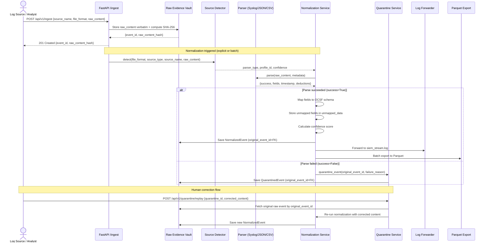

# SentinelTrace V5 — Architecture

**SIH 2026 · PS 26156 · Universal Log Pre-processing Framework**

---

## 1. High-Level Architecture

SentinelTrace V5 follows a layered architecture with strict separation between the evidence preservation layer, the normalization engine, and the output/integration layer.

```
┌─────────────────────────────────────────────────┐
│              HETEROGENEOUS SOURCES               │
│  Syslog · JSON · CSV · Firewalls · Auth · Servers│
└────────────────────────┬────────────────────────┘
                         │ POST /api/v1/ingest
                         ▼
┌─────────────────────────────────────────────────┐
│           INGESTION & EVIDENCE LAYER             │
│  - Raw payload stored verbatim                  │
│  - SHA-256 fingerprint sealed immediately        │
│  - Event ID assigned                            │
└────────────────────────┬────────────────────────┘
                         │
                         ▼
┌─────────────────────────────────────────────────┐
│              NORMALIZATION ENGINE                │
│  Source Detector → Parser → Field Extraction    │
│  → OCSF Mapping → Unmapped Field Preservation   │
│  → Confidence Scoring → Validation              │
│         │                        │              │
│      NORMALIZED              FAILED             │
│         │                        │              │
│    Normalized Event         Quarantine (DLQ)    │
│         │                   Human Fix → Replay  │
└────────┬────────────────────────┬───────────────┘
         │                        │
         ▼                        ▼ (after replay)
┌────────────────┐     ┌──────────────────────────┐
│  JSONL Forwarder│     │   Parquet Data Lake       │
│  (SIEM Stream)  │     │   /outputs/datalake/...   │
└────────────────┘     └──────────────────────────┘
         │
         ▼
┌─────────────────────────────────────────────────┐
│         SECURITY INTELLIGENCE EXTENSIONS         │
│  Detection Rules · Semantic Policies · Risk      │
│  Incidents · Compliance · Analytics              │
└─────────────────────────────────────────────────┘
```

---

## 2. Component Architecture

### Frontend (`frontend/`)
- **Framework**: React 18 + Vite 5
- **Routing**: React Router DOM v6 (single-page application)
- **Auth**: JWT stored in `localStorage` under key `sentinel_token`. `AuthContext` provides `login()`, `logout()`, `hasPermission()`, `hasRole()`.
- **Pages**: 26 page modules, each representing a functional UI workspace (Evidence Vault, OCSF Normalization, Quarantine DLQ, Semantic Policies, etc.)
- **Key Pages**:
  - `EvidenceVault.jsx` — Ingestion form + raw event ledger + integrity verification modal
  - `Normalization.jsx` — Normalized event ledger + batch normalize + trace link
  - `Quarantine.jsx` — DLQ table + Fix & Replay modal
  - `Dashboard.jsx` — Live pipeline stats from API

### Backend (`backend/`)
- **Framework**: FastAPI (Python 3.11/3.12) with Uvicorn ASGI server
- **Structure**:

```
backend/app/
├── core/          # JWT auth, RBAC permissions, password hashing
├── models/        # 27 SQLAlchemy ORM models
├── parsers/       # Log parser classes (SyslogParser, JSONParser, CSVParser)
├── routers/       # 33 FastAPI route modules
├── schemas/       # Pydantic request/response models
├── services/      # Business logic (normalization, quarantine, export, etc.)
├── config.py      # Pydantic-settings configuration
├── database.py    # Engine + session factory + SQLite fallback
└── main.py        # FastAPI app, router registration, startup tables
```

### Database
- **Primary**: PostgreSQL 15 (Docker deployment)
- **Fallback**: SQLite (`sentinel_trace.db`) — automatically used when PostgreSQL is unreachable
- **ORM**: SQLAlchemy 2.0 declarative models
- **Migrations**: Alembic (`backend/migrations/versions/`)
- **Key tables**: `ingested_events`, `normalized_events`, `quarantined_events`, `source_profiles`, `users`, `roles`, plus 20+ tables for the extended intelligence suite

---

## 3. ULPF Data Flow (Detailed)



---

## 4. Storage Architecture

### `ingested_events` table
| Column | Type | Description |
|---|---|---|
| `event_id` | VARCHAR PK | `evt_{16 hex chars}` |
| `source_name` | VARCHAR | Identifying name of the log source |
| `source_type` | VARCHAR | Category: `firewall`, `authentication`, `system` |
| `file_format` | VARCHAR | `text`, `json`, `csv` |
| `raw_content` | TEXT | Verbatim raw payload — never modified |
| `raw_content_hash` | VARCHAR | SHA-256 hex digest of `raw_content` |
| `ingested_at` | TIMESTAMP | UTC ingestion timestamp |
| `processing_status` | VARCHAR | `PRESERVED`, `NORMALIZED`, `FAILED` |
| `metadata_` | JSON | Caller-provided metadata |

### `normalized_events` table
| Column | Type | Description |
|---|---|---|
| `normalized_event_id` | VARCHAR PK | `norm_{16 hex chars}` |
| `original_event_id` | VARCHAR FK | → `ingested_events.event_id` |
| `class_uid` | INTEGER | OCSF class (1001, 3001, 4001) |
| `class_name` | VARCHAR | Human-readable OCSF class |
| `action` | VARCHAR | Canonical action token |
| `src_ip` | VARCHAR | Source IP |
| `dst_ip` | VARCHAR | Destination IP |
| `user_name` | VARCHAR | Username if present |
| `raw_data` | JSON | All extracted fields (parsed) |
| `unmapped_data` | JSON | Fields not in OCSF schema |
| `normalization_status` | VARCHAR | `NORMALIZED`, `PARTIAL`, `FAILED` |
| `normalization_confidence` | FLOAT | 0.0–1.0 deterministic score |

### `quarantined_events` table
| Column | Type | Description |
|---|---|---|
| `quarantine_id` | VARCHAR PK | `dlq_{16 hex chars}` |
| `original_event_id` | VARCHAR FK | → `ingested_events.event_id` |
| `failure_reason` | TEXT | Parser error message |
| `status` | VARCHAR | `PENDING`, `RESOLVED`, `REPLAYED` |
| `raw_content` | TEXT | Copy of original payload |

---

## 5. Security Architecture

### Authentication
- JWT tokens signed with HMAC-SHA256 (`HS256`)
- Token issued by `POST /api/v1/auth/login`
- All protected endpoints require `Authorization: Bearer <token>` header
- Token validation: signature verification + expiry check in `app/core/security.py`

### Role-Based Access Control
- 5 roles: `ADMIN`, `SECURITY_ANALYST`, `POLICY_AUTHOR`, `POLICY_REVIEWER`, `AUDITOR`, `VIEWER`
- 32 named permissions (e.g., `EVENT_WRITE`, `QUARANTINE_MANAGE`, `SOURCE_PROFILE_APPROVE`)
- Endpoint protection via `require_permission()` FastAPI dependency decorator

### Maker-Checker Governance
- Source profile activation requires a proposer and a different approver (`proposer_id ≠ approver_id`)
- Enforced in `source_profile_service.py` `activate_profile()` method

### Evidence Integrity
- SHA-256 re-computation on demand via `GET /api/v1/events/{event_id}/verify`
- The stored hash is compared against a freshly computed hash of `raw_content`
- Any discrepancy indicates database tampering

---

## 6. Deployment Architecture

### Local Development
```
Developer machine
├── Backend: uvicorn on port 8000 (SQLite fallback)
└── Frontend: Vite dev server on port 5173
```

### Docker Deployment
```
docker-compose.yml
├── db: postgres:15-alpine (port 5432)
├── backend: FastAPI + uvicorn (port 8000)
└── frontend: React/Nginx (port 3000)
```

### Air-Gapped Operation
The application has no external API calls in its critical path. All cryptographic operations use Python's standard library `hashlib`. Docker images can be pre-built and transferred offline via `docker save` / `docker load`.

---

## 7. Current Prototype vs. Production Scale-up

| Aspect | Current Prototype | Production Scale-up |
|---|---|---|
| Database | SQLite (single file) / PostgreSQL | PostgreSQL + TimescaleDB |
| Ingestion | Synchronous HTTP POST | Async Kafka consumers |
| Normalization | In-process FastAPI background task | Dedicated worker pool |
| Storage | Local filesystem for Parquet/JSONL | S3 / GCS object storage |
| Key management | Environment variable | HSM / Vault |
| Throughput | Not benchmarked | Requires load testing |
| Parsers | 3 active (Syslog, JSON, CSV) | Source-pack expansion |
