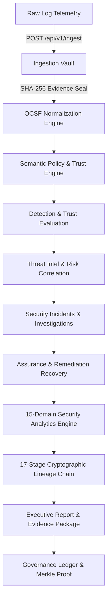

# SentinelTrace V5 Architecture Master Reference

## System Architecture Diagram

## Layered Component Breakdown
1. **API & Interface Layer**: 29 FastAPI routers delivering RESTful JSON endpoints to 26 React Command Centers.
2. **Parsing & Normalization Layer**: Formats raw telemetry into standard OCSF v1.1.0 JSON payloads.
3. **Detection & Correlation Layer**: Rules, threat intelligence feeds (IOCs), and risk scoring models.
4. **Governance & Ledger Layer**: Merkle tree builder, append-only ledger, and Maker-Checker enforcement.
