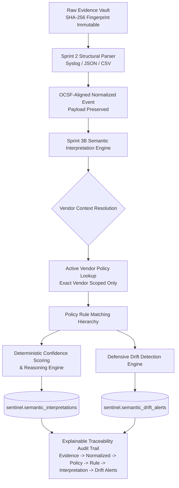

# Sprint 03B Completion Report: Semantic Interpretation Engine & Semantic Drift Detection

**Project:** SentinelTrace V5 — Verifiable Security Log Normalization & Semantic Trust Governance Platform  
**Sprint:** Sprint 3B  
**Date:** 2026-09-06  
**Status:** **PASS** (100% Functional & Verified, 42/42 Regression Tests Passing)  
**Architecture Version:** 5.0  

---

## 1. Executive Summary & Objective

Sprint 3B delivers the **Semantic Interpretation Engine**, **Semantic Drift Detection Engine**, and **Explainable Interpretation Audit Trail** for SentinelTrace V5.

### Core Architectural Principle:
$$\text{Structural Parsing (Sprint 2)} \neq \text{Semantic Interpretation (Sprint 3B)}$$

Sprint 2 extracts format-specific syntactic fields and maps them into OCSF-aligned canonical structures. Sprint 3A maintains the vendor-scoped semantic policy registry. **Sprint 3B applies those vendor-scoped policies deterministically** to produce derived semantic interpretations without ever modifying raw evidence or normalized events.

### The Vendor Isolation Proof:
The system strictly enforces that the exact same raw token yields distinct, vendor-isolated meanings:
- **Cisco ASA Firewall:** `PERMIT` $\rightarrow$ `action.result = ALLOWED` (Classification: `COMPATIBLE`, Risk: `LOW`, Confidence: `0.90`)
- **Demo Vendor Appliance:** `PERMIT` $\rightarrow$ `action.result = MONITORED` (Classification: `AMBIGUOUS`, Risk: `MEDIUM`, Confidence: `0.60`, Drift Alert: `AMBIGUOUS_MAPPING`)

**Cross-vendor borrowing and global fallback mappings are strictly prohibited.**

---

## 2. Architecture & Pipeline



---

## 3. Database Schema Design (PostgreSQL / Alembic)

Alembic Migration: `c3d4e5f6a7b8_create_semantic_interpretation_tables.py`

### 1. `sentinel.semantic_interpretations`
| Column | Type | Description |
| :--- | :--- | :--- |
| `id` | Integer (PK) | Auto-increment primary key |
| `interpretation_id` | String (Unique) | Unique identifier (`interp_<hex>`) |
| `normalized_event_id` | String (FK, Index) | Link to `sentinel.normalized_events` |
| `original_event_id` | String (FK, Index) | Traceability to `sentinel.ingested_events` |
| `policy_id` | String (FK, Index) | Active policy applied |
| `policy_version` | String | Version of policy at execution time |
| `vendor_name` | String | Resolved vendor context |
| `source_profile_id` | String | Source profile identifier |
| `source_field` | String | Original source field evaluated |
| `source_value` | String | Raw extracted token value |
| `canonical_field` | String | Target canonical OCSF field |
| `interpreted_value` | String (Nullable) | Derived semantic value |
| `equivalence_classification`| String | EQUIVALENT, COMPATIBLE, AMBIGUOUS, INCOMPATIBLE |
| `risk_level` | String (Index) | LOW, MEDIUM, HIGH, CRITICAL |
| `interpretation_status` | String (Index) | INTERPRETED, UNMAPPED, AMBIGUOUS, CONFLICT, FAILED |
| `confidence_score` | Float | Deterministic score $[0.0, 1.0]$ |
| `confidence_reasons` | JSON | Itemized deduction explanations |
| `explanation` | Text | Human-readable audit narrative |
| `created_at` | DateTime (Index) | UTC creation timestamp |

### 2. `sentinel.semantic_drift_alerts`
| Column | Type | Description |
| :--- | :--- | :--- |
| `id` | Integer (PK) | Auto-increment primary key |
| `alert_id` | String (Unique) | Unique identifier (`alert_<hex>`) |
| `normalized_event_id` | String (FK, Index) | Affected normalized event |
| `interpretation_id` | String (FK, Index) | Related interpretation |
| `policy_id` | String | Active policy at detection |
| `drift_type` | String (Index) | UNMAPPED_VALUE, AMBIGUOUS_MAPPING, POLICY_CONFLICT, PROTECTED_FIELD_RISK, INCOMPATIBLE_MAPPING |
| `severity` | String (Index) | LOW, MEDIUM, HIGH, CRITICAL |
| `status` | String (Index) | ACTIVE, ACKNOWLEDGED, RESOLVED, SUPPRESSED |
| `description` | Text | Diagnostic alert description |
| `expected_value` | String (Nullable) | Expected canonical value |
| `observed_value` | String (Nullable) | Observed token value |
| `detected_at` | DateTime (Index) | Detection timestamp |
| `resolved_at` | DateTime (Nullable) | Resolution timestamp |

---

## 4. Policy Matching Hierarchy & Deterministic Rules

1. **Exact Policy Scoping:** Policy must match resolved `vendor_name` and `source_profile_id` with `status = ACTIVE`.
2. **Exact Field & Value Matching:** `source_field` and `source_value` match case-insensitively.
3. **Conflict Detection:** If multiple rules in the same policy match but produce divergent canonical target values $\rightarrow$ `status = CONFLICT`, `confidence = 0.00`, drift alert `POLICY_CONFLICT` (HIGH severity).
4. **Unmapped Fallback Handling:** If no active rule exists $\rightarrow$ `status = UNMAPPED`, `confidence = 0.50`, drift alert `UNMAPPED_VALUE` (MEDIUM severity). Global fallback is strictly disabled.

### Confidence Deductions:
- Base: `1.00`
- `COMPATIBLE`: `-0.10`
- `AMBIGUOUS`: `-0.25`
- `INCOMPATIBLE`: `-0.40`
- `UNMAPPED`: `-0.50`
- Protected Semantic Field Ambiguity: Additional `-0.15`
- Conflicting Rules: Set to `0.00`
- Clamped: $0.00 \le \text{confidence} \le 1.00$

---

## 5. API Endpoints

- `POST /api/v1/normalized-events/{normalized_event_id}/interpret` — Run semantic interpretation (Idempotent)
- `GET /api/v1/semantic-interpretations` — List interpretations with filters (`status`, `risk_level`, `vendor_name`, `policy_id`) & pagination
- `GET /api/v1/semantic-interpretations/{interpretation_id}` — Get single interpretation details
- `GET /api/v1/semantic-interpretations/{interpretation_id}/trace` — Complete end-to-end audit chain from Raw Evidence to Drift Alerts
- `GET /api/v1/semantic-drift-alerts` — List drift alerts with filters (`severity`, `status`, `drift_type`) & pagination
- `GET /api/v1/semantic-drift-alerts/{alert_id}` — Get single drift alert details

---

## 6. Automated Verification & Test Results

```
Ran 42 tests in 1.615s
OK
- Sprint 1 (Evidence Vault): 8/8 PASS
- Sprint 2 (Parsers & Normalization): 10/10 PASS
- Sprint 3A (Policy Registry): 10/10 PASS
- Sprint 3B (Interpretation & Drift): 14/14 PASS
```

All 14 Sprint 3B specific tests passed:
1. Cisco ASA `PERMIT` $\rightarrow$ `ALLOWED`
2. Demo Vendor `PERMIT` $\rightarrow$ `MONITORED`
3. Same raw token yields vendor-isolated interpretations
4. No global mapping fallback exists
5. Unknown semantic value produces `UNMAPPED` status
6. Unmapped value creates `UNMAPPED_VALUE` drift alert
7. `AMBIGUOUS` rule creates `AMBIGUOUS_MAPPING` drift alert
8. Protected semantic field ambiguity creates `PROTECTED_FIELD_RISK` alert (HIGH severity)
9. Conflicting rules create `POLICY_CONFLICT` alert (HIGH severity)
10. Confidence scoring is deterministic with clear reasons
11. Repeated interpretation is idempotent
12. Original normalized event remains unchanged
13. Raw evidence remains unchanged (SHA-256 fingerprint verified)
14. Trace endpoint shows complete 6-stage audit chain

---

## 7. Frontend Integration & Evidence Artifacts

The React + Vite cybersecurity dashboard has been extended with the **Semantic Intelligence** module:
- **KPI Metrics Cards:** Total Interpretations, High Risk Count, Drift Alerts, Ambiguous Mappings
- **Interactive Pipeline Diagram:** Visualizes Normalized Event $\rightarrow$ Policy Lookup $\rightarrow$ Rule Matching $\rightarrow$ Decision $\rightarrow$ Drift Anomaly Check
- **Interactive Interpretations Table:** Filter by status, vendor, and risk level with direct Trace modal launcher
- **Drift Alert Panel:** Real-time visibility into unmapped, ambiguous, and protected field risks
- **Traceability Modal:** Visualizes the full cryptographic and semantic provenance chain

### Captured Screenshots (`evidence/sprint-03b/screenshots/`):
- `01_semantic_intelligence_dashboard.png`
- `02_cisco_permit_interpretation.png`
- `03_demo_vendor_permit_interpretation.png`
- `04_vendor_isolation_comparison.png`
- `05_unmapped_drift_alert.png`
- `06_ambiguous_mapping_alert.png`
- `07_interpretation_traceability.png`
- `08_swagger_semantic_api.png`
- `09_database_interpretations.png`
- `10_docker_services.png`

---

## 8. Known Limitations & Freeze Boundaries

- Sprint 3B focuses on deterministic rule-based semantic interpretation and defensive drift alerts.
- STIG graph topological propagation, dual-control approval workflows, cryptographic ledger anchoring, and authentication are planned for future sprints (Sprints 4–7).
